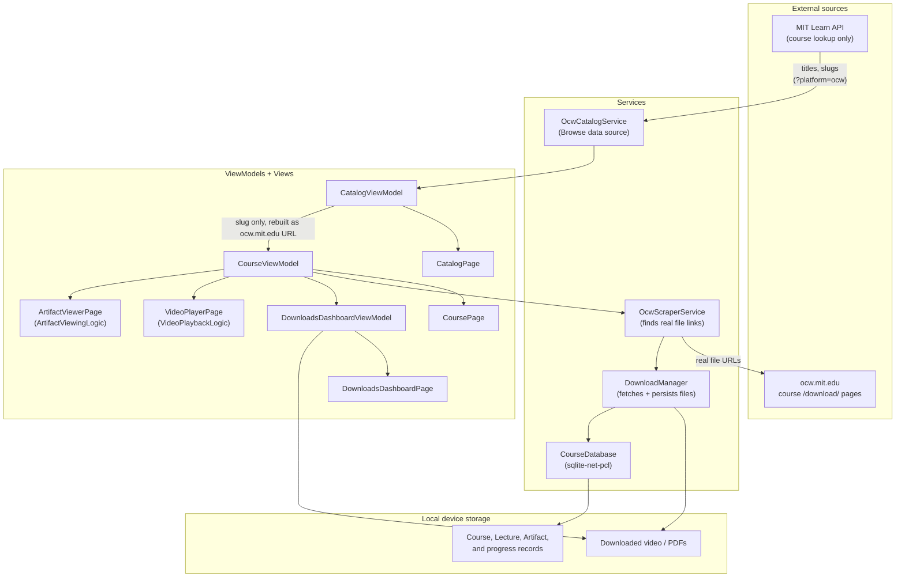

# Architecture

For what this app is and why it exists, see [../README.md](../README.md).
This document is the technical deep dive: how the pieces fit together, what
talks to what, and the reasoning behind the one non-obvious integration (MIT
Learn).

## Overview

The app is a .NET MAUI mobile app (Android/iOS) built around a simple
pipeline: find a course, pull its files from MIT OpenCourseWare, store them
locally, and play them back — tracking watch/view progress along the way.



## Why MIT Learn is in the picture at all

OCW's own `/search/` and course-listing pages render client-side — a plain
HTTP fetch returns an empty shell, no course data. MIT Learn, a separate MIT
discovery site, is server-rendered and backed by a real JSON API that
returns exactly the course metadata Browse needs (titles, departments,
terms, slugs) — and MIT's own official course-export tooling
(`mitodl/ocw_oer_export`) uses that same API for the same purpose, so it's
not an ad hoc workaround.

**Scope of the integration — deliberately narrow:**

- MIT Learn is queried with `?platform=ocw`, so non-OCW content (MITx, xPRO,
  etc., which MIT Learn also indexes) is filtered server-side before it
  reaches the app.
- The app never uses the URL MIT Learn returns. `CourseViewModel` extracts
  only the course *slug* and always rebuilds `ocw.mit.edu/courses/{slug}/download/`
  itself before calling `OcwScraperService`. Even if a non-OCW result ever
  slipped past the platform filter, tapping it would 404 against OCW rather
  than pulling content from wherever it actually lives.
- There's also a manual slug-entry path on `CoursePage` that bypasses Browse
  (and MIT Learn) entirely — MIT Learn is not load-bearing for the app to
  function.
- **Known limitation:** MIT Learn's production host (`api.learn.mit.edu`)
  has not been confirmed live from this sandboxed development environment;
  only a staging host has been verified against. Worth a direct check once
  the app is actually running on a device with normal network access.

## Project structure

```
OcwOffline/
├── Models/            Course, Lecture, Artifact, CatalogEntry
├── Services/
│   ├── OcwCatalogService.cs     MIT Learn client — Browse data source only
│   ├── OcwScraperService.cs     Parses OCW's own /download/ pages for real file links
│   ├── DownloadManager.cs       HTTP fetch + local file persistence, resume/retry
│   ├── CourseDatabase.cs        sqlite-net-pcl persistence layer
│   ├── AppPaths.cs              Platform-specific storage path resolution
│   ├── VideoPlaybackLogic.cs    Pure decision logic behind VideoPlayerPage
│   └── ArtifactViewingLogic.cs  Pure decision logic behind ArtifactViewerPage
├── ViewModels/
│   ├── CatalogViewModel.cs
│   ├── CourseViewModel.cs
│   └── DownloadsDashboardViewModel.cs
├── Views/              XAML pages + value converters
└── Platforms/          Android/iOS entry points and platform-specific config

OcwOffline.Tests/        Unit tests, mirrored by folder against OcwOffline/
devtools/                Static verification tooling (see below)
docs/contracts/          Verified external facts (API schemas, package versions)
```

## Static verification tooling

`devtools/csharp_lint.py` is a dependency-free static checker used throughout
development: brace/paren/bracket balance, XAML `{Binding}`/`CommandParameter`
cross-checks against the actual C# class (including
CommunityToolkit.Mvvm's `[ObservableProperty]`/`[RelayCommand]`
naming-generation rules), `{StaticResource}` key validation, and unresolved
`using` detection. It does not type-check or resolve overloads — it's a
static-analysis aid, not a substitute for compiling.

## Data flow summary

1. **Browse** (optional): `OcwCatalogService` queries MIT Learn, returns a
   list of `CatalogEntry` records to `CatalogViewModel`.
2. **Select a course**: `CourseViewModel` takes a slug (from Browse or typed
   directly) and asks `OcwScraperService` to parse that course's OCW
   `/download/` page into real video/PDF/zip URLs.
3. **Download**: `DownloadManager` fetches those URLs, writes files to local
   device storage, and records status/progress in `CourseDatabase`.
4. **Watch/view offline**: `VideoPlayerPage`/`ArtifactViewerPage` read local
   files and update watch-progress records — no network required from this
   point on.
5. **Dashboard**: `DownloadsDashboardViewModel` aggregates status across all
   downloaded courses (in-progress, completed, failed, storage used).
